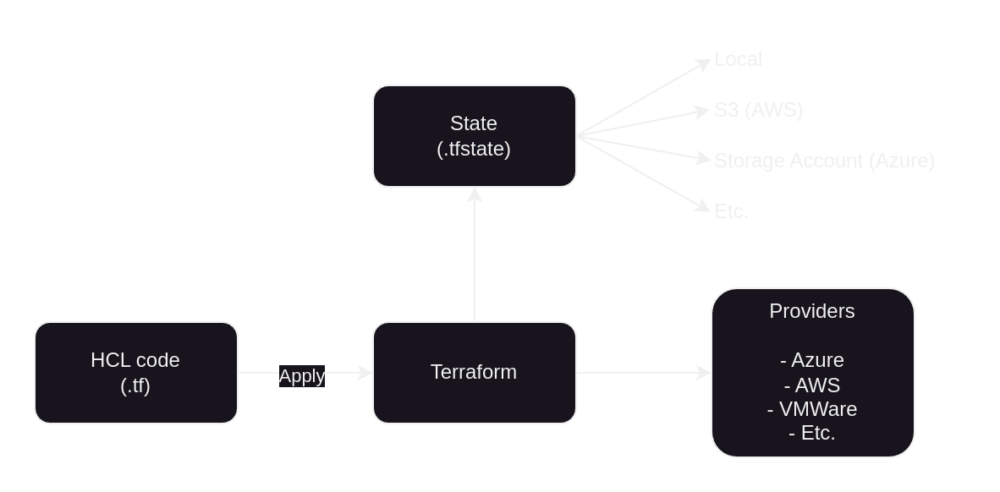

# Terraform 101

This project is for learning to build infrastructure using Terraform. In this case, a virtual machine will be created in Azure with an IIS server and a "Hello World" page.

## Introduction

Terraform is an Infrastructure-as-Code (IaC) tool created by HashiCorp that allows to create cloud or on-premise resources, like servers, databases, storages and networks with code. This tool has a declarative character so, when the tool runs, whats is written as code will be the final state of the resources, no matter which manually change was made via the portal or cli.

## HCL

Terraform use its own language called HCL (HashiCorp Configuration Language), using blocks for creating configurations and resources.

This code it must be saved as a `.tf` file. Is important to know that is not neccesary for the code to be written on the same file. It would be possible to separete it on different files with any name, so it's possible to agroup common resources on that files.

The two

```hcl
terraform {
  required_providers {
    aws = {
      source  = "hashicorp/aws"
      version = "~> 5.0"
    }
  }
}

# Configure the AWS Provider
provider "aws" {
  region = "us-east-1"
}
```

```hcl
terraform {
  backend "s3" {
    bucket = "mybucket"
    key    = "path/to/my/key"
    region = "us-east-1"
  }
}
```

## Providers

Providers are a Terraform components for communicating with APIs for creating resources, even cloud or on-premise. There are 3 types:

- Official: providers mantained by HashiCorp.
- Partner: mantained by important companies.
- Community: mantained by the comminity. Somethings could be unestable or insecure to use it.

## Modules

Modules are a like "packages" of Terraform code that allows you reuse configurations for other projects.

For example, if is often the necessity to create a basic group of resources on cloud such as a VM connected to internet, a security group, load balancer, etc. If is a really repetitive task, probably will be better to create a module an reuse it every time indeed.

So, instead of creating every resource individually, it will be possible to call the module and this package will creating every necessary to make it work correctly.

## Registry

## State file

## Architecture

The way of working for Terraform is:

- Write the HCL code for connecting to a provider (Azure, AWS, etc.) and for creating resources.
- **(optional)** Select where save the state. For default, it will be saved on the local folder.
- Run Terraform commands to apply changes.
- Terraform will compare the code with the current state of the resources, and will apply changes to let the resources exactly as the code says.



## Main commands

- `terraform validate`:
- `terraform plan`:
- `terraform apply`:
- `terraform destroy`:

## Laboratory
